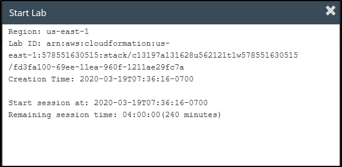
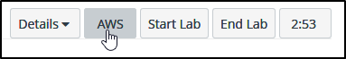
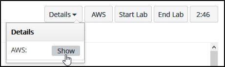
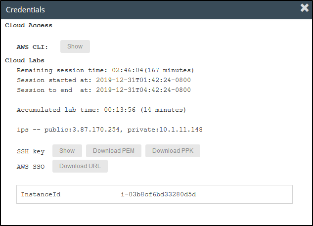
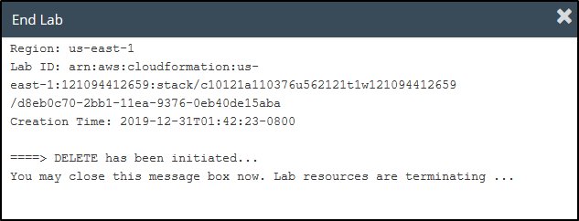

# How to Complete Lab Exercises

## 1. Start a Lab

When you are ready to start a lab exercise, click the **Start Lab** button.

This creates a temporary AWS console account, starts a lab timer and starts configuring any services that are required for the lab exercise. You will see a dialogue window showing lab creation progress.

Wait until you see the message **Lab status: ready** then close the dialogue window.

The lab timer starts counting down.

When the counter reaches zero, all the services you have configured will be terminated and your temporary account is deactivated. If you need more time, click the **Start Lab** button again to reset the timer. You can reset the timer as many times as you like.

## 2. Open a Console

Click the *AWS* button.

A new tab opens in the AWS Console. You are logged in with the temporary account.

## 3. View Lab Details

From the lab page, click **Details** and **Show**.

A dialogue opens showing details of how long you have remaining in the lab, service details such as IP addresses and names that may be required by the exercise, and credentials for SSH or CLI access to your temporary account.

## 4. Lab Limits

Some services that are not required for the lab exercises may be disabled. You will receive a permission error in the console if you attempt to use a disabled service.

There is a credit limit for each lab exercise. If you reach the credit limit then your temporary account is disabled, your services are terminated and you will not be able to start the lab again. This does not affect the other lab exercises. The credit limit is at least double the amount required to complete the lab exercises.

## 5. Stop a Lab

When you have completed a lab, click the **End Lab** button.

Any services you have configured will be terminated.

It may take five minutes for the lab to be terminated. **It will not be possible to re-start the lab until the termination is complete.**

You can repeat lab exercises as many times as you like until you hit the credit limit. It is not possible to view your credit balance.

## Troubleshooting

Some students experience problems with initializing labs and downloading PEM and PPK files when using Microsoft Internet Explorer or Edge. If you experience this problem, the solution is to use Firefox or Chrome browsers.

If you receive 'The credentials in your login link were invalid. Please contact your administrator." Click the here in the error to logout and restart the lab.

If a student chooses the AWS button to login to the AWS Management Console, and is presented with a page that says, “You must first log out before logging into a different AWS account”, tell the student to choose the “To logout, click here” link. Then they should return to the lab instructions page and click the AWS button two times.
