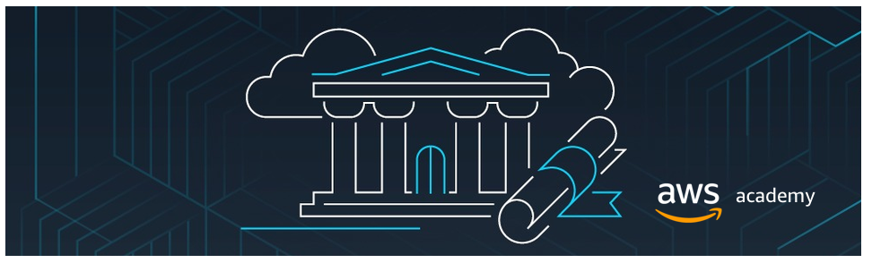

# AWS-Academy-Machine-Learning-for-Natural-Language-Processing

Welcome to the AWS Academy platform, which will serve as our primary teaching and learning hub for the duration of this course. Specifically, for our Text Mining and Information Retrieval course, we will leverage the resources of *AWS Class - AWS Academy Machine Learning for Natural Language Processing (NLP)*.

This platform provides the convenience of accessing lesson reviews, activities, and laboratory exercises, all readily available even on your mobile device. It serves as the solution to address our limited to no laboratory hours.
